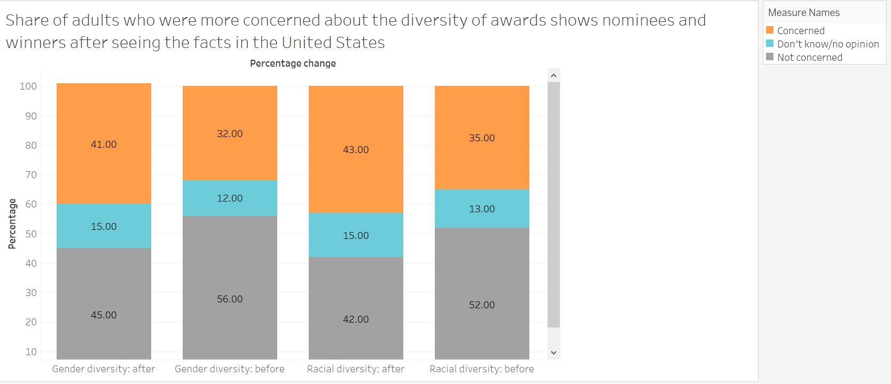
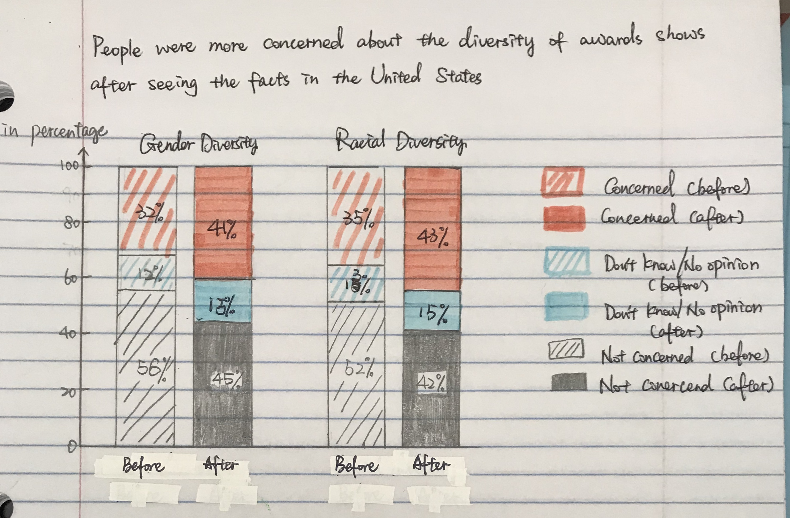

# Assignment 3 & 4: Critique by Design
 - The original data visualization is this following link: https://www.statista.com/statistics/1092688/awards-shows-racial-gender-diversity-us/
 - I Selected this particular data visualization is because I am interested in the entertainment industry and how this industry projects impacts to the society at large. Another reason is that the data contained in this data visualization is relatively complete to explain the story which the author wants to convery, which enables me to focus on the data presentation instead of searching and cleaning data in the redesign process. The original graph is complete and able to understand but there is still room to make the graph more robust.

My first draft is as follows:

Documentation for redesign:
I consulted my friends how they perceive my first draft and what they know from looking at it in the first sight. All of them said they can see the percentage change inside each of the segments in the four bars, but they thought its a picture of four different things. And three of them said that although they saw the "percentage" label, they still would perceive the amount on the bar as count instead of percentage. After gathering their thoughts and feeedbacks, I reflect on how to show this data visualization in two pairs instead of four unrelated, individual aspects. And the amounts shown on the bars without the percentage sign is confusing, since it violates people's common sense. When people see numbers, they will automatically think them as count and sum, instead of percentage.

A couple paragraphs describing what your process was.  You should include a few insights you gained from the critique method, 
and what it led you to think about when considering a redesign, if anything.  You should talk about how you moved next to the wireframes, 
and any insights you gleaned from your user feedback.  If it led you to change anything about your data visualization's design, 
mention what that was.  Finally, talk about what your redesigned data visualization shows, 
why you selected the data visualization you did, and what you attempted to show or do differently. 

My redesign graph:

