# Wirefames for user feedback
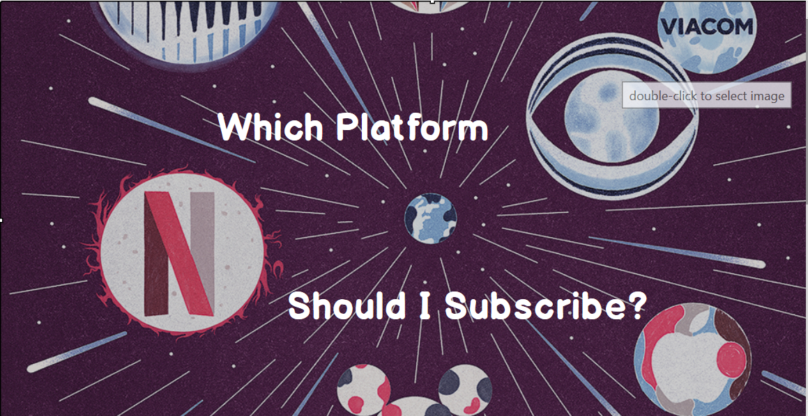
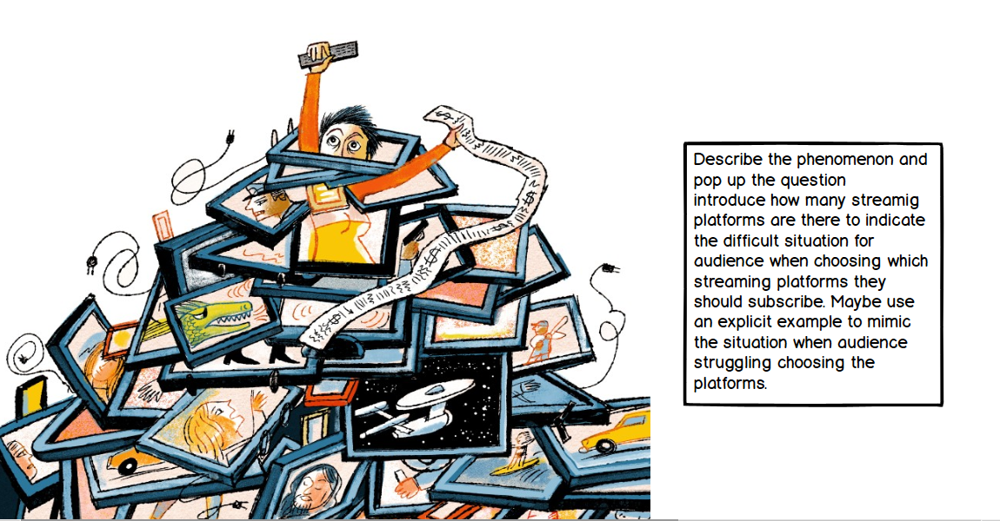
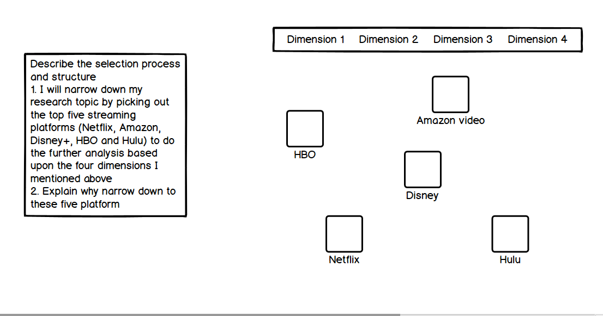
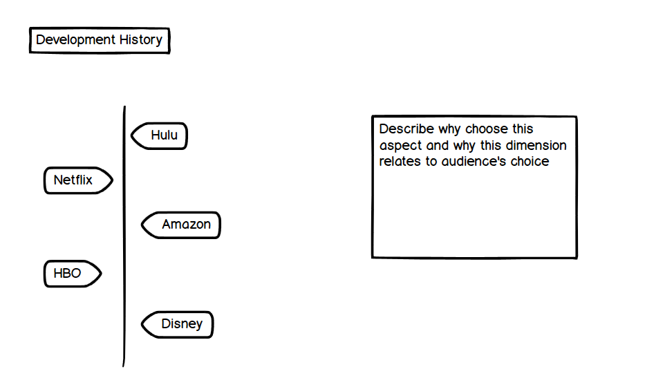
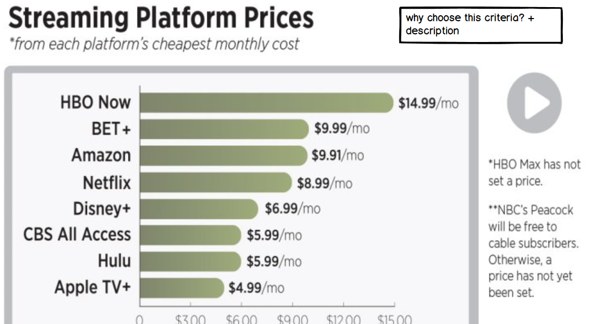
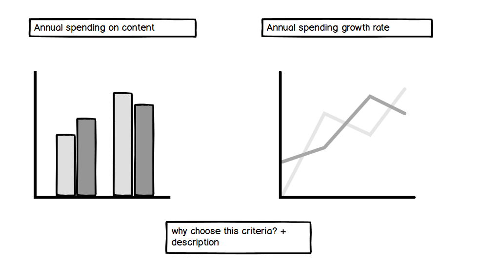
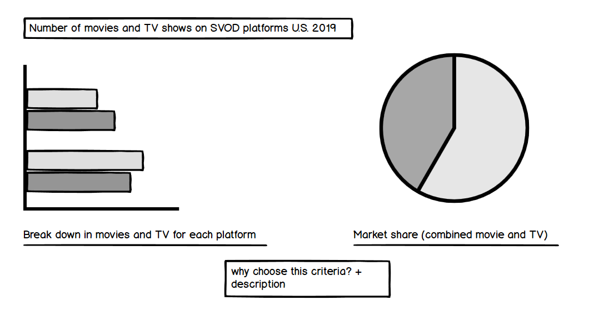
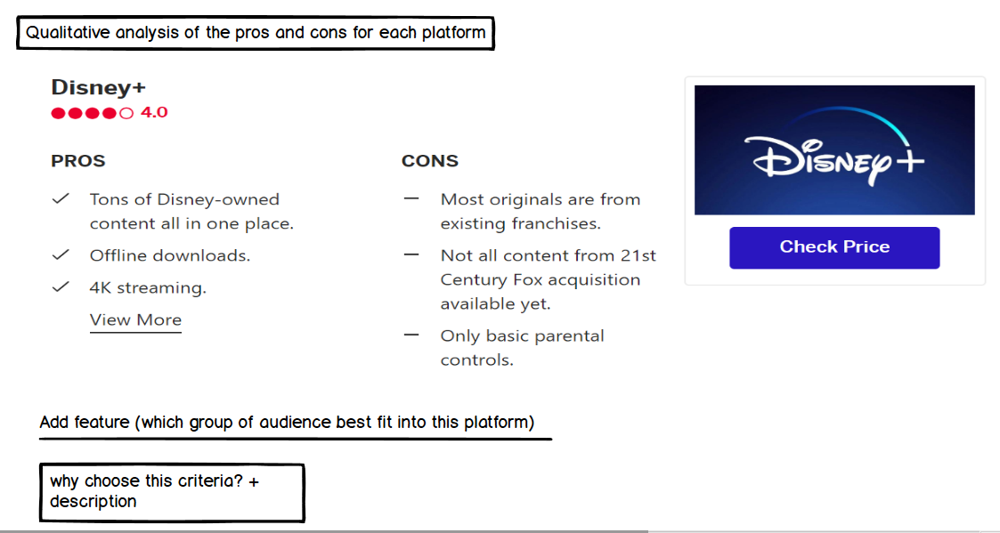
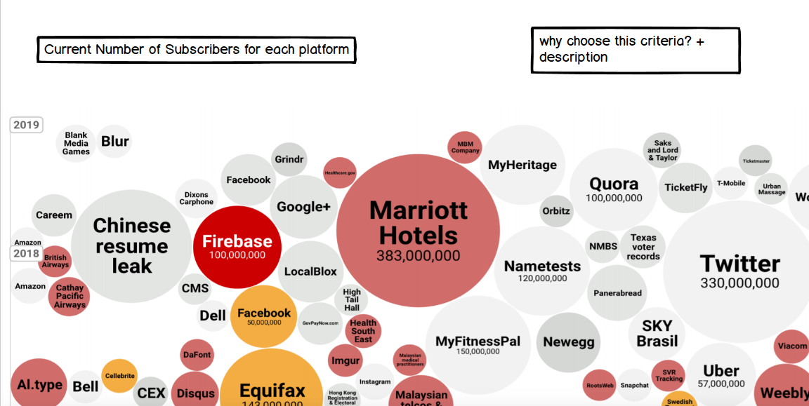
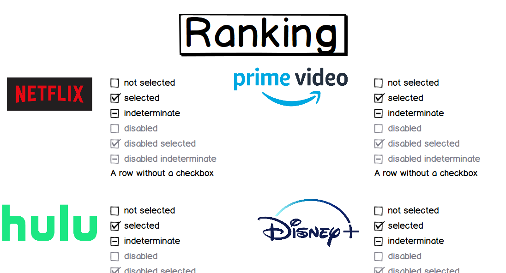
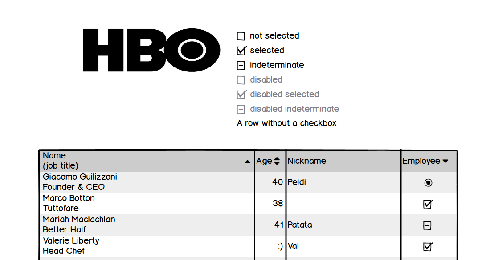

# Creation of a user research protocol and completion of at least three interviews
1. the target audience: any audience who are confused about which streaming platform he/she should subscribe to in the U.S.
2. identify representative individuals to interview: I interviewed students at Heinz College with various backgrounds, with one from information system major, one from entertainment industry management major and one from public policy major. One of the reasons why I chose Heinz students is because they are the active user group for streaming platforms and this topic may relate to them more.
3. interview script:
Can you describe to me what the storyline is telling you?
Who do you think is the intended audience? If this is not clear, are there ways to make it clearer?
•	Are those picture or icon there appropriate?
•	Is there anything you find surprising or confusing?
•	Is there anything you would change or do differently?
•	Is there any additional information you would like to know?
•	Did you get any new idea or understanding of the topic from this?
•	Imagine that you are having trouble choosing which platform to subscribe, do you think that the storyline is informative and persuasive enough to inspire you to take action?
4. the findings from the interviews:
•	Similarities:

5. changes I implemented to my wireframes to address the issues identified:

# Revised wireframes based on what you heard
Finally, you'll put these changes into practice in your wireframes / storyboards.  Begin refining your wireframes / storyboards reflecting what you've identified and learned through your user research.   For the purpose of this assignment, your final wireframes should essentially be an early draft of your final project that includes your project outline, sketches, and brings your storyboards to life.  For most of you this will mean that you've created a digital outline or shell that you can then begin to further refine and improve heading into Part III, and it should begin to feel complete enough that an external reviewer can easily tell how you're beginning to craft your story.  Therefore you should begin taking your outline and building out the structure of your story into 

 note similarities and differences between the observations of your interviewees.  

