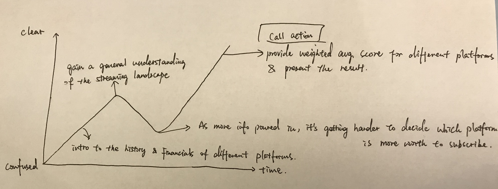
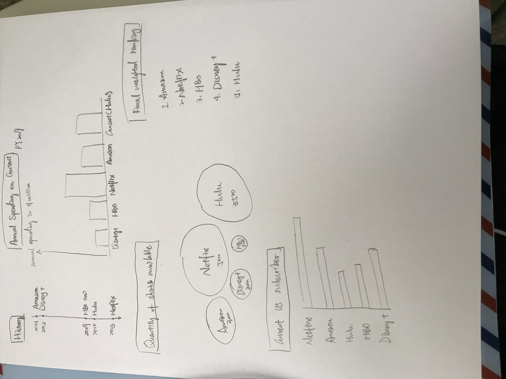

# PART ONE
## The Outline
Summary:
As a student majoring in entertainment industry, I am really interested about the current streaming wars. As there are more and more streaming platforms rising up, audience become confused about which platform they should subscribe. The purpose of this final project is to help audience to analyze which streaming platform is the most promising one that worth the investment (subscription). 

Project Structure:  
The project will analyze the top 5 streaming platforms: Netflix, Amazon, Disney+, HBO and Hulu from four dimensions, and will provide a weighted average score for audience to reference.

The four dimensions are as follows:
1. the history of running the platform (the launch data). 20% 
2. the annual spending on content. 30%
3. the quantity of shows available on the platform. 30%
4. the number of current subscribers. 20%

The percentage listed at the end of each dimension is the weighted number. The ranking number will be displayed in an order where 5 is the best, and 1 is the poor. The final score will be calculated by multiplying the weighted percentage with the respective ranking.
Please refer the following picture for the 'call to action' and 'story arc'.

## Initial Sketches

## The Data
The data source:
1. https://observer.com/2019/10/netflix-disney-apple-amazon-hbo-max-peacock-content-budgets/
2. https://www.axios.com/disney-netflix-content-spending-b7cc36a9-0d4a-495b-a191-01020e099a6e.html
3. https://www.fastcompany.com/90410798/netflix-spent-an-estimated-15-billion-on-original-content-in-2019-ahead-of-disney-and-apple-tvs-launches

I found a overall introduction to the current landscape of the streaming wars among the major platforms on Fast Company website. It has data relates to the biggest original content deals, the current US subsribers, the quantity vs quality of the shows provided etc. But these figures are not in a uniform style. Sometimes Fast Company will only focus on one platform (and it's normally Netflix) and sometimes it focuses on the comparison of 3 to 4 platforms. Thus, I would like to gather more information to complete the comparison based on the data Fast Company already has.

From Observer, I found the the spending on content creation for each of the big streaming platforms and their breakdown of the budget. This can serve as the complementary data source to the Fast Company one.
A couple of paragraphs that document your data source(s), and an explanation of how you plan on using your data. 

Axios did a pretty much similar job as Observer. The reason why choose this data source is to have a well-rounded and relatively non-biased opinion and data support when generating insights based on that. Thus, back-up/supporting data source can be very helpful.

## Method and Medium
I am planning to use Shorthand to complete my final project with the help of Balsamiq wireframe, Datawrapper, Tableau and Rawgraphs.

First I will introduce how many streamig platforms are there to indicate the difficult situation for audience when choosing which streaming platforms they should subscribe. Maybe use an explicit example to mimic the situation when audience struggling choosing the platforms.

Second, I will narrow down my research topic by picking out the top five streaming platforms (Netflix, Amazon, Disney+, HBO and Hulu) to do the further analysis based upon the four dimensions I mentioned above.

Third, I will gather the data to complete the comparison among these five platforms and give out rankings. This is the part where I will generate one graph for each of the dimensions. Then I will do the weighted score to finalize which platform is the most well-rounded, promising one that worth audience to subscribe. The finalize ranking will also be a data visualization.

- To view the second part of the final project, [please click on me!](/Final_Project_Part_2.md)
- To view the third part of the final project, [please click on me!](/Final_Project_Part_3.md)

Please click on the header "Portfolio" to go back to the front page.
